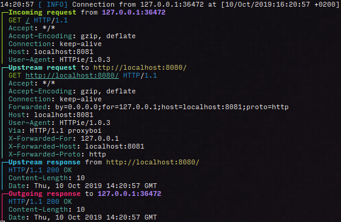

# proxyboi

**A super simple reverse proxy with TLS support**

## How to run

In order to listen for proxy requests on all local interfaces on port 8080 and proxy them to a service running at example.com, do:

    proxyboi -l 0.0.0.0:8080 http://example.com

You can also feed your TLS certificates into it:

    proxyboi -l 0.0.0.0:8080 --cert mycert.pem --key mykey.key http://example.com

You can see a detailed (and pretty!) verbose log using `-v`:

    proxyboi -l 0.0.0.0:8080 http://example.com -v

## Usage

    proxyboi 0.4.5
    Sven-Hendrik Haase <svenstaro@gmail.com>
    A super simple reverse proxy with TLS support

    USAGE:
        proxyboi [FLAGS] [OPTIONS] <upstream>

    FLAGS:
        -h, --help        Prints help information
        -k, --insecure    Allow connections against upstream proxies with invalid TLS certificates
        -q, --quiet       Be quiet (log nothing)
        -V, --version     Prints version information
        -v, --verbose     Be verbose (log data of incoming and outgoing requests)

    OPTIONS:
        -l, --listen <listen>      Socket to listen on [default: 0.0.0.0:8080]
            --timeout <timeout>    Connection timeout against upstream in seconds (including DNS name resolution) [default: 5]
            --cert <tls-cert>      TLS cert to use
            --key <tls-key>        TLS key to use

    ARGS:
        <upstream>    Upstream proxy to use (eg. http://localhost:8080)

## Releasing

This is mostly a note for me on how to release this thing:

- Make sure `CHANGELOG.md` is up to date.
- `cargo release --dry-run <version>`
- `cargo release <version>`
- Releases will automatically be deployed by Github Actions.
- Docker images will automatically be built by Docker Hub.
- Update AUR package.
